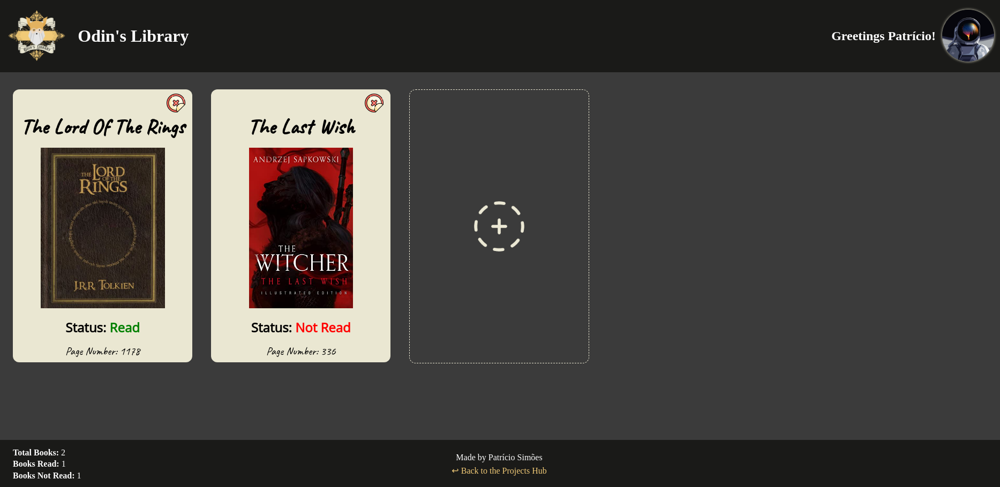

<h1>Project Summary:</h1>

- This is a virtual library made with HTML, CSS & JS.
- It's purpose is to store readed books in a 'virtual library' GUI.
- It does not feature a DB, so every stored book disappears when refreshing the page.

<h1>Project Preview:</h1>

<h1>Asset's Authors:</h1>

- The following is a list under the form of "Image | Source | Author", of all the images sources and authors used in the project:

- Logo | Made it myself, it's a combination of The Odin's Project official logo and some other elements.
- Delete Icon | https://www.flaticon.com/free-icon/rejected_9123478 | Freepik
- The Lord Of The Rings Book Cover ! https://static0.colliderimages.com/wordpress/wp-content/uploads/2016/07/the-lord-of-the-rings-book-cover.jpg | unknown
- The Last Wish Book Cover | https://m.media-amazon.com/images/P0316333522.01._SCLZZZZZZZ_SX500_.jpg | unknown
