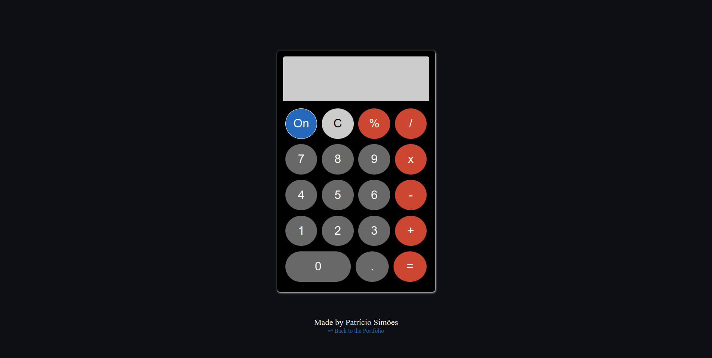

<h1>Project Summary:</h1>

- This is a rather simple calculator project.
- It has a GUI interface built with HTML & CSS and has it's data manipulated by Javascript.
- This was the last project of 'The Foundations' section of The Odin Project.

<h1>Project Structure:</h1>

- The project was built with HTML, CSS & JS.
- There is only one HTML page, 'home.html', there is one CSS stylesheet, 'styles.css' and there are three JS scripts:
    - 'document.js' - This is where the HTML elements are fetched from the DOM and stored in JS variables;
    - 'app.js' - This is where the JS login is implemented;
    - 'events.js' - This is where the events are triggered and somehow it is an extension to 'app.js'.

<h1>Project Preview:</h1>

